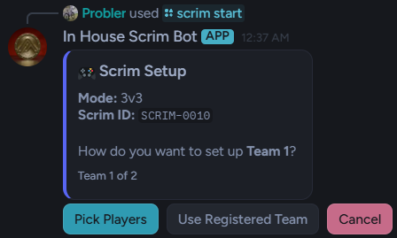
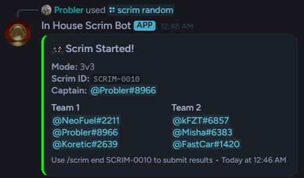
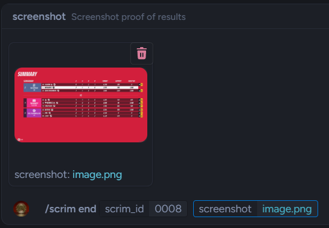
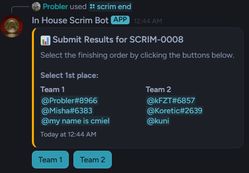
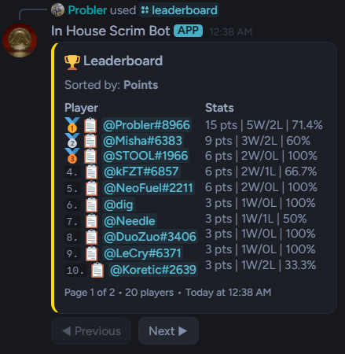
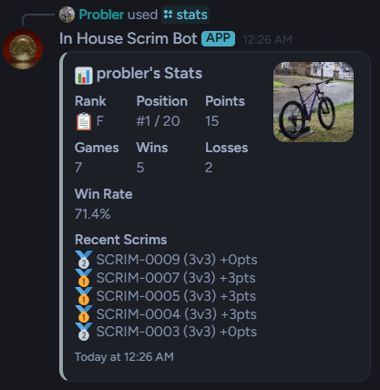
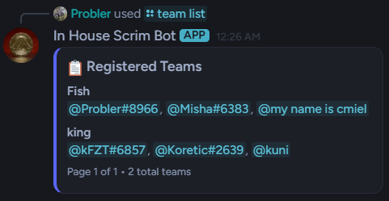
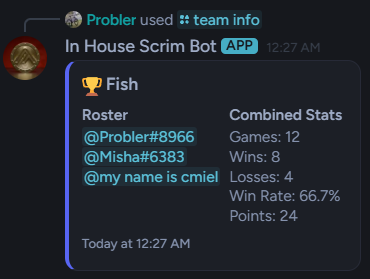
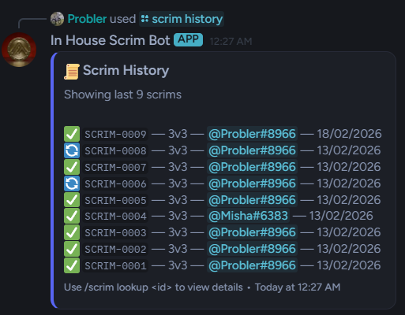
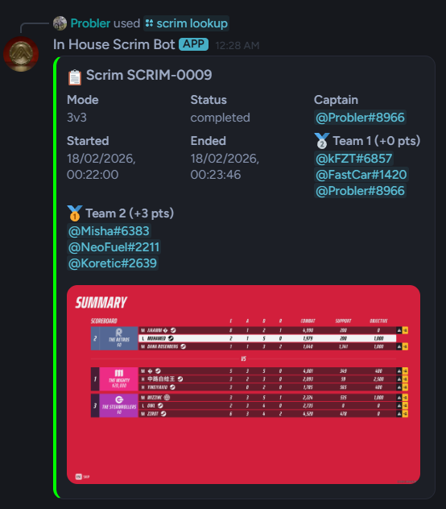

# In House Scrim Bot

A custom Discord bot built for managing competitive scrims in **The Finals**. Designed for the In House community to track player performance, manage teams, and maintain fair competition.

> ⚠️ **This is a showcase repository.** Source code is private. For inquiries, contact me on Discord or via [probler.uk](https://probler.uk)

---

## 🎮 Features

### Scrim Management
- **Random Team Generation** — Automatically shuffle players into balanced teams
- **Manual Team Setup** — Pick players or use pre-registered teams with an interactive button interface
- **Multi-Mode Support** — 3v3 (6 players) and 3v3v3v3 (12 players) formats
- **Screenshot Verification** — Required proof for all match results
- **Result Amendment** — Admins can correct mistakes with automatic point recalculation

### Team System
- **Team Registration** — Save regular teams for quick scrim setup
- **Team Stats** — Track combined performance across all members
- **Roster Management** — Easy team creation and deletion

### Player Statistics
- **Individual Stats** — Games played, wins, losses, win rate, total points
- **Rank Tiers** — S, A, B, C, D, F rankings based on points
- **Recent Match History** — View last 5 scrims per player

### Leaderboards
- **Multiple Sort Options** — Points, wins, win rate, games played
- **Paginated Display** — Clean navigation for large player bases
- **Live Rankings** — Position tracking against all players

### Moderation
- **Blacklist System** — Prevent problematic users from starting scrims
- **Admin Controls** — Result amendment, team deletion, scrim cancellation
- **Dispute System** — Scrim IDs for easy result verification

---

## 📸 Screenshots

### Scrim Setup

*Interactive team selection with buttons and dropdowns*

### Random Team Generation

*Automatic shuffling of players into balanced teams*

### Result Submission

*Upload screenshot proof of match results*

*Button-based placement selection*

*Final results with points awarded*

### Leaderboard

*Paginated leaderboard with rank tiers and stats*

### Player Stats

*Detailed individual statistics with recent match history*

### Team Management

*Registered teams with paginated display*

*Team roster and combined stats*

### Scrim History & Lookup

*Complete history of all scrims with status indicators*

*Detailed view of past scrims including screenshot proof*

---

## 🛠️ Tech Stack

- **Runtime:** Node.js
- **Library:** discord.js v14
- **Database:** SQLite (better-sqlite3)
- **Hosting:** Self-hosted

---

## 📋 Command Overview

### Scrim Commands
| Command | Description |
|---------|-------------|
| `/scrim random` | Randomise players into teams |
| `/scrim start` | Manual team setup with buttons |
| `/scrim end` | Submit results with screenshot |
| `/scrim cancel` | Cancel without recording stats |
| `/scrim lookup` | View past scrim details |
| `/scrim active` | Show ongoing scrims |
| `/scrim history` | View recent scrims |
| `/scrim amend` | Admin: correct results |

### Team Commands
| Command | Description |
|---------|-------------|
| `/team create` | Register a new team |
| `/team delete` | Remove a team (Admin) |
| `/team list` | View all teams |
| `/team info` | View team roster & stats |

### Stats Commands
| Command | Description |
|---------|-------------|
| `/stats` | View player statistics |
| `/leaderboard` | View top players |

### Admin Commands
| Command | Description |
|---------|-------------|
| `/blacklist add` | Block user from starting scrims |
| `/blacklist remove` | Unblock user |
| `/blacklist list` | View blocked users |

---

## 🏆 Ranking System

Players earn points based on placement:

**3v3 Mode:**
| Placement | Points |
|-----------|--------|
| 🥇 1st | 3 |
| 🥈 2nd | 0 |

**3v3v3v3 Mode:**
| Placement | Points |
|-----------|--------|
| 🥇 1st | 5 |
| 🥈 2nd | 3 |
| 🥉 3rd | 1 |
| 4th | 0 |

**Rank Tiers:**
| Tier | Points Required |
|------|-----------------|
| 🏆 S | 500+ |
| 💎 A | 350+ |
| 🥇 B | 200+ |
| 🥈 C | 100+ |
| 🥉 D | 50+ |
| 📋 F | 0+ |

---

## 🔒 Why Private?

This bot was custom-built for a specific community. The source code remains private to:

- Maintain competitive advantage for the In House server
- Prevent unauthorised copies on competing servers
- Protect the time and effort invested in development

If you're interested in a similar bot for your community, feel free to reach out.

---

## 📬 Contact

- **Portfolio:** [probler.uk](https://probler.uk)
- **Discord:** @Probler
- **GitHub:** [@probler-yt](https://github.com/probler-yt)

---

## 🙏 Acknowledgements

Built for the In House community. Special thanks to everyone who helped test and provide feedback.

---

*Last updated: February 2026*